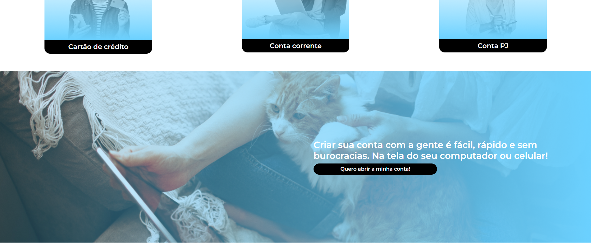
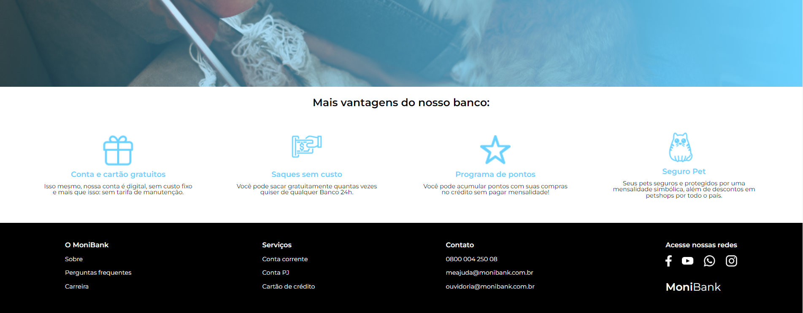
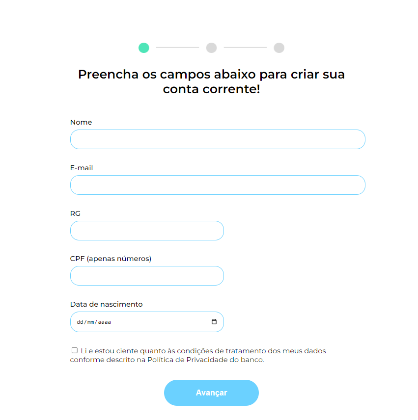
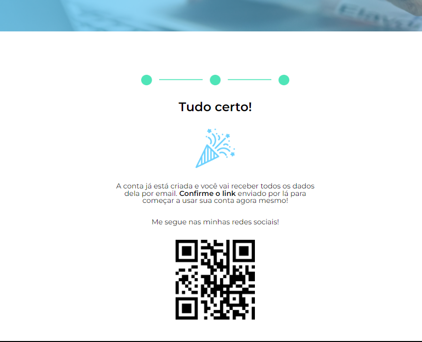

# Alura MoniBank

Project of Alura MoniBank

## Table of contents

- [Overview](#overview)
  - [The challenge](#the-challenge)
  - [Screenshot](#screenshot)
  - [Links](#links)
- [My process](#my-process)
  - [Built with](#built-with)
  - [What I learned](#what-i-learned)
  - [Continued development](#continued-development)
  - [Useful resources](#useful-resources)
- [Author](#author)

## Overview

A project challenged by [Alura](https://cursos.alura.com.br/course/javascript-validando-formularios)

### The challenge

Users should be able to:

- Send form data, verify and storage it;

### Screenshot









### Links

- Solution URL: [GitHub respository](https://github.com/ViniCellist/Alura-MoniBank)

## My process

- Started creating `script.js`, that is responsible to verify each field and throw errors based on error validity...
    - `check-age.js` is responsible to verify if user is under eighteen;
    - `check-cpf.js` is responsible to verify CPF validation;
    - `cam.js` is responsible to capture and save an user's picture


### Built with

- HTML5
- CSS3
    - Flexbox
    - Grid
- JavaScript
- JSON

### What I learned

New usages in JavaScript, such as:
```
    btnTakePic.addEventListener('click', function() {
        canvas.getContext('2d').drawImage(video, 0, 0, canvas.width, canvas.height)

        imageURL = canvas.toDataURL("image/jpeg");

        fieldCam.style.display = "none";
        message.style.display = "block";
    });
```
this code captures and saves user's picture taken from webcam

### Continued development

Keep my focus on becoming a fullstack Dev...

### Useful resources

- [HTML](https://developer.mozilla.org/en-US/docs/Web) 
- [CSS](https://developer.mozilla.org/en-US/docs/Web/CSS)
- [JavaScript](https://developer.mozilla.org/pt-BR/docs/Web/JavaScript)
- [JSON](https://www.json.org/json-pt.html)


## Author

- GitHub - [Personal Profile](https://github.com/ViniCellist)
- LinkedIn - [Professional Profile](https://www.linkedin.com/in/vinicius-de-souza-duarte-57937b192/)
- Instagram - [Personal Profile](https://www.linkedin.com/in/viniciussouzaduarte/)
